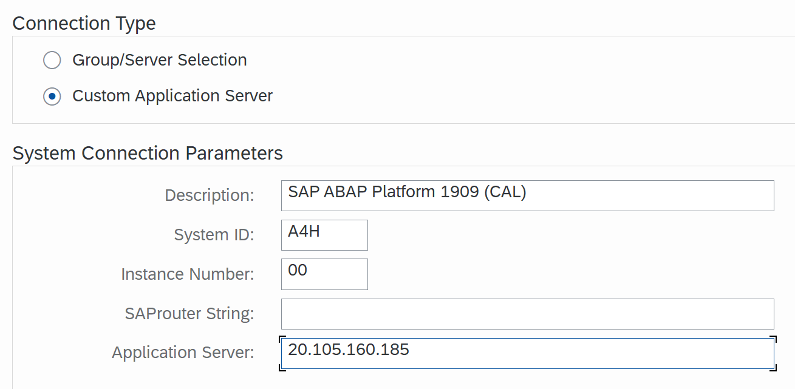
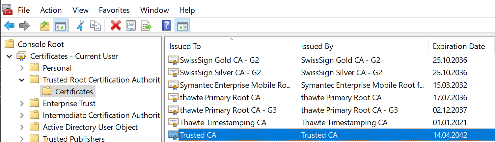
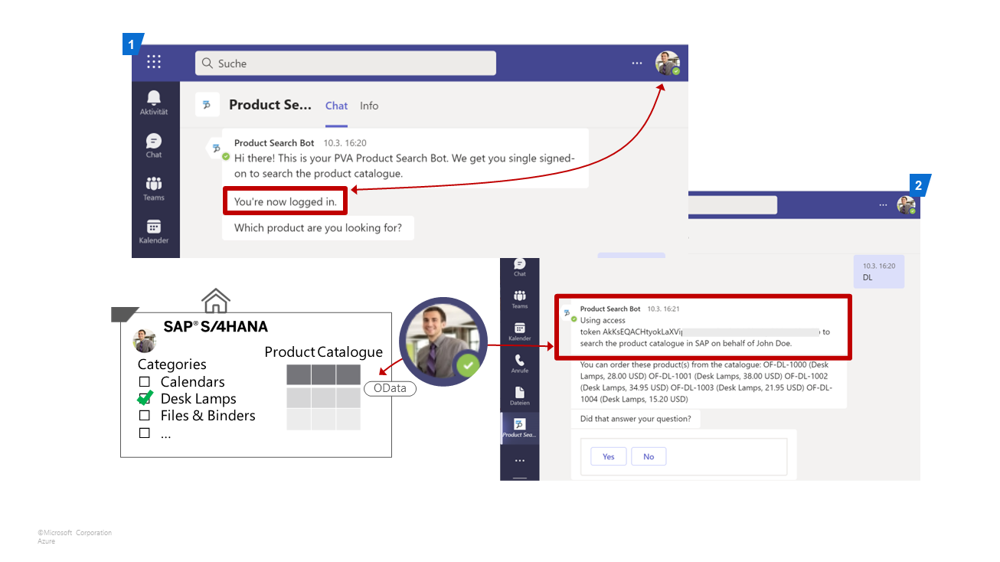
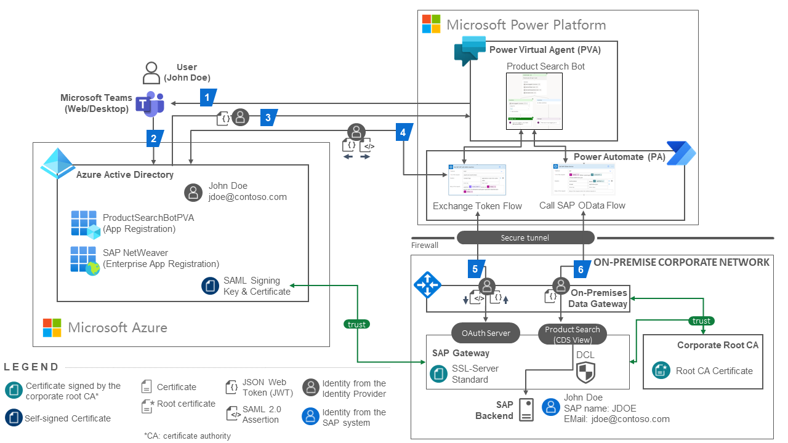
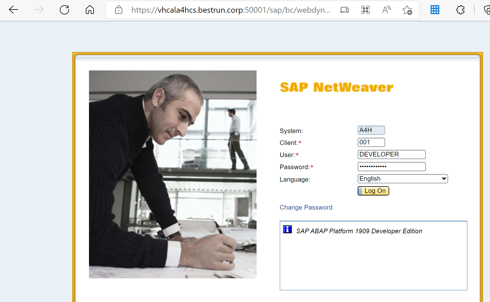
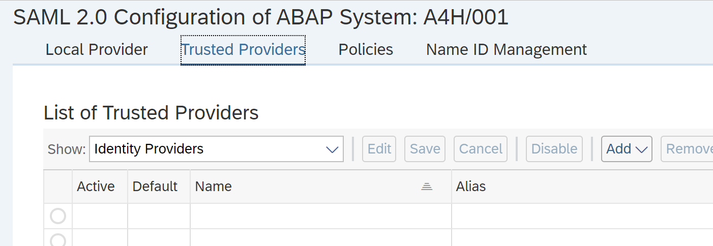

# Single Sign-On between Microsoft Power Platform and SAP - Hands-On Lab Instructions

This repository contains the instructions (this file) and supporting material for the hands-on lab based on the blog post [Principal Propagation between Microsoft Power Platform and SAP](https://blogs.sap.com/2021/04/13/principal-propagation-in-a-multi-cloud-solution-between-microsoft-azure-and-sap-business-technology-platform-btp-part-iv-sso-with-a-power-virtual-agent-chatbot-and-on-premises-data-gateway/).

## Preparation

Make sure you meet the following prerequisites for the best workshop experience:

* Install SAP GUI on your local workstation and configure the connection to the SAP backend system (IP `20.105.160.186`, SID `A4H`) used in the workshop with the following parameters:



* *Optional*: Configure name resolution of the SAP backend's FQDN in your local hosts file by adding the following line: 
```
20.105.160.185 vhcala4hcs.bestrun.corp vhcala4hci.dummy.nodomain
```
  
* *Optional*: To avoid security warning in the web browser, add the backend system's TLS issuer (CA) [certificate](files/trustedca.crt) to the trusted root authorities on your local workstation. For Windows, run `mmc.exe`, add the Certificate Snap-in, and import the certificate to the `Trusted Root Certificate Authorities` folder:

  

## System access
You will group in separate teams (1 to 10) that use the following user accounts for administrative access to the SAP backend system, Microsoft Power Platform and Microsoft Azure subscription:
| Team | SAP Client | SAP User  | Power Platform |
| ---- | ---------- | --------- | ------------------- |
| 1    | 001        | DEVELOPER | team1@bestruncorp.onmicrosoft.com |
| 2    | 002        | DEVELOPER | team2@bestruncorp.onmicrosoft.com |
| 3    | 003        | DEVELOPER | team3@bestruncorp.onmicrosoft.com |
| 4    | 004        | DEVELOPER | team4@bestruncorp.onmicrosoft.com |
| 5    | 005        | DEVELOPER | team5@bestruncorp.onmicrosoft.com
| 6    | 006        | DEVELOPER | team6@bestruncorp.onmicrosoft.com |
| 7    | 007        | DEVELOPER | team7@bestruncorp.onmicrosoft.com |
| 8    | 008        | DEVELOPER | team8@bestruncorp.onmicrosoft.com |
| 9    | 008        | DEVELOPER | team9@bestruncorp.onmicrosoft.com |
| 10    | 010        | DEVELOPER | team10@bestruncorp.onmicrosoft.com |

The instructor will provide the required password credentials for the users in the table above.
## Business scenario

In this workshop you will implement a complete business scenario by integrating Microsoft and SAP technologies. From the end-user's perspective, you will use a chatbot in Microsoft Teams that lets you search and order office equipment in a product catalogue managed in a corporate SAP backend system. Access to the product data in the backend is restricted to certain product categories on a user level. For example, Jane Smith may only be allowed to order batteries and desk lamps, and John Doe can only order chairs.

The main requirement from a functional and security perspective is to provide seamless and secure access between the chatbot and the backend system. The user must not be asked to provide any credentials when accessing the SAP backend to search the catalogue. Instead, the already logged-on user in the chatbot is securely propagated to the backend system. This requires a two-step security token exchange:
1. The token issed to the bot by Azure AD must be exchanged to a SAML assertion. This exchange is handled by Azure AD
2. The bot uses the SAML assertion to seamlessly log on the user in the SAP backend system and request an OAuth access token. This access token issed by the SAP backend system for the user can be used to call the OData service for the search operation in the backend.

 

Please refer to the corresponding [blog post](https://blogs.sap.com/2021/04/13/principal-propagation-in-a-multi-cloud-solution-between-microsoft-azure-and-sap-business-technology-platform-btp-part-iv-sso-with-a-power-virtual-agent-chatbot-and-on-premises-data-gateway/) of this lab for a detailled explanation of the technical flow in this scenario.
## Exercises

You will implement the exercises of the hands-on lab in an isolated team environment to complete the implementation of the business scenario. Due to time constraints, the environment is pre-configured. The following exercises focus on the most relevant configuration steps to gain a deeper understanding of the different components and their integration.

Make sure you have a team number (1-10) assigned before starting with the exercises. Ask your instructor for help if needed.
### Exercise 1: Configure trust between Azure AD and the SAP backend system

| Step | Description | Screenshot | 
| ---- | ----------- | ---------- |
| 1    | Login to the SAML2 configuration of the [SAP backend system](https://vhcala4hcs.bestrun.corp:50001/sap/bc/webdynpro/sap/saml2) with user DEVELOPER. Use the client assigend to your team (001...010). **Note**: If have *not* maintained your local name resolution as described above, use this [URL](https://20.105.160.185:50001/sap/bc/webdynpro/sap/saml2) and confirm the security warning in your browser. |  |
| 2    | Select the Trusted Providers tab |    |
| 3    | |            |

### Exercise 2: Setup the OAuth Client for the Chatbot in the SAP backend system

| Step | Description | Screenshot | 
| ---- | ----------- | ---------- |
| 0000 | Lorem ipsum |            |

### Exercise 3: Create the connection in Power Platform for the token exchange flow

| Step | Description | Screenshot | 
| ---- | ----------- | ---------- |
| 0000 | Lorem ipsum |            |

### Exercise 4: Test the chatbot in Power Virtual Agent web client

| Step | Description | Screenshot | 
| ---- | ----------- | ---------- |
| 0000 | Lorem ipsum |            |

### Exercise 5: Inspect the SAML assertion sent to the backend system for the token exchange

| Step | Description | Screenshot | 
| ---- | ----------- | ---------- |
| 0000 | Lorem ipsum |            |

### Exercise 6: Change the user's authorizations in the backend and test again

| Step | Description | Screenshot | 
| ---- | ----------- | ---------- |
| 0000 | Lorem ipsum |            |

