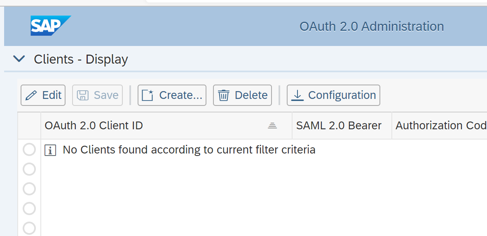
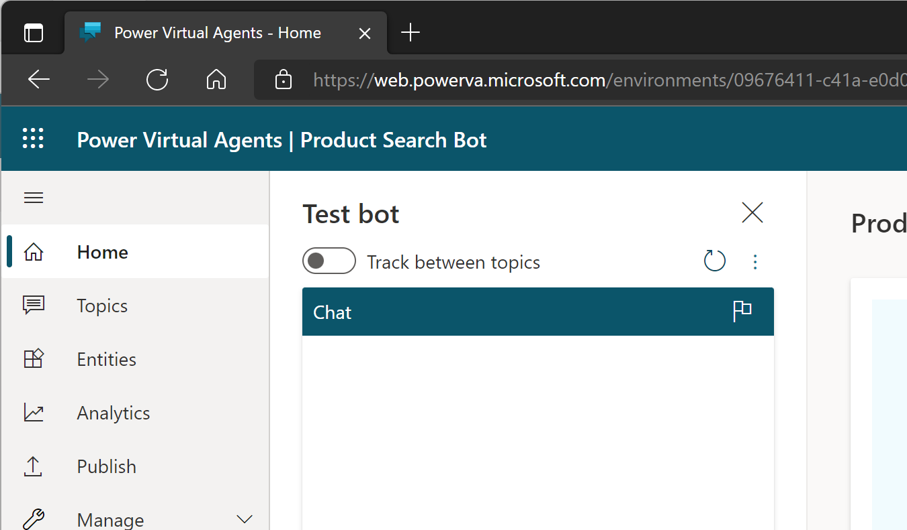

# Single Sign-On between Microsoft Power Platform and SAP - Hands-On Lab Instructions

This repository contains the instructions (this file) and supporting material for the hands-on lab based on the blog post [Principal Propagation between Microsoft Power Platform and SAP](https://blogs.sap.com/2021/04/13/principal-propagation-in-a-multi-cloud-solution-between-microsoft-azure-and-sap-business-technology-platform-btp-part-iv-sso-with-a-power-virtual-agent-chatbot-and-on-premises-data-gateway/).

## Preparation

Make sure you meet the following prerequisites for the best workshop experience:

* Install SAP GUI on your local workstation and configure the connection to the SAP backend system (IP `20.105.160.186`, SID `A4H`) used in the workshop with the following parameters:


* *Optional*: Configure name resolution of the SAP backend's FQDN in your local hosts file by adding the following line: 
```
20.105.160.185 vhcala4hcs.bestrun.corp vhcala4hci.dummy.nodomain
```
  
* *Optional*: To avoid security warning in the web browser, add the backend system's TLS issuer (CA) [certificate](files/trustedca.crt) to the trusted root authorities on your local workstation. For Windows, run `mmc.exe`, add the Certificate Snap-in, and import the certificate to the `Trusted Root Certificate Authorities` folder:

  

## System access
You will group in separate teams (1 to 10) that use the following user accounts for administrative access to the SAP backend system, Microsoft Power Platform and Microsoft Azure subscription:
| Team | SAP Client | SAP User  | Power Platform |
| ---- | ---------- | --------- | ------------------- |
| 1    | 001        | DEVELOPER | team1@bestruncorp.onmicrosoft.com |
| 2    | 002        | DEVELOPER | team2@bestruncorp.onmicrosoft.com |
| 3    | 003        | DEVELOPER | team3@bestruncorp.onmicrosoft.com |
| 4    | 004        | DEVELOPER | team4@bestruncorp.onmicrosoft.com |
| 5    | 005        | DEVELOPER | team5@bestruncorp.onmicrosoft.com
| 6    | 006        | DEVELOPER | team6@bestruncorp.onmicrosoft.com |
| 7    | 007        | DEVELOPER | team7@bestruncorp.onmicrosoft.com |
| 8    | 008        | DEVELOPER | team8@bestruncorp.onmicrosoft.com |
| 9    | 008        | DEVELOPER | team9@bestruncorp.onmicrosoft.com |
| 10    | 010        | DEVELOPER | team10@bestruncorp.onmicrosoft.com |

The instructor will provide the required password credentials for the users in the table above.
## Business scenario

In this workshop you will implement a complete business scenario by integrating Microsoft and SAP technologies. From the end-user's perspective, you will use a chatbot in Microsoft Teams that lets you search and order office equipment in a product catalogue managed in a corporate SAP backend system. Access to the product data in the backend is restricted to certain product categories on a user level. For example, Jane Smith may only be allowed to order batteries and desk lamps, and John Doe can only order chairs.

The main requirement from a functional and security perspective is to provide seamless and secure access between the chatbot and the backend system. The user must not be asked to provide any credentials when accessing the SAP backend to search the catalogue. Instead, the already logged-on user in the chatbot is securely propagated to the backend system. This requires a two-step security token exchange:
1. The token issed to the bot by Azure AD must be exchanged to a SAML assertion. This exchange is handled by Azure AD
2. The bot uses the SAML assertion to seamlessly log on the user in the SAP backend system and request an OAuth access token. This access token issed by the SAP backend system for the user can be used to call the OData service for the search operation in the backend.

 

Please refer to the corresponding [blog post](https://blogs.sap.com/2021/04/13/principal-propagation-in-a-multi-cloud-solution-between-microsoft-azure-and-sap-business-technology-platform-btp-part-iv-sso-with-a-power-virtual-agent-chatbot-and-on-premises-data-gateway/) of this lab for a detailled explanation of the technical flow in this scenario.
## Exercises

You will implement the exercises of the hands-on lab in an isolated team environment to complete the implementation of the business scenario. Due to time constraints, the environment is pre-configured. The following exercises focus on the most relevant configuration steps to gain a deeper understanding of the different components and their integration.

Make sure you have a team number (1-10) assigned before starting with the exercises. Ask your instructor for help if needed.
### Exercise 1: Configure trust between Azure AD and the SAP backend system

Start the implementation by setting up the required trust relationship between the business user's Azure AD tenant and the SAP backend system. Without this trust relationship, the SAP system would reject the SAML assertion issued by Azure AD and seamless single sign-on fails in the scenario.

| Step | Description | Screenshot | 
| ---- | ----------- | ---------- |
| 1 | Open a browser and login to the SAML2 configuration of the [SAP backend system](https://vhcala4hcs.bestrun.corp:50001/sap/bc/webdynpro/sap/saml2) with user DEVELOPER. Use the client assigend to your team (001...010).<br/><br/>**Note**: If have *not* maintained your local name resolution as described above, use [this URL](https://20.105.160.185:50001/sap/bc/webdynpro/sap/saml2) and confirm the security warning in your browser. |  |
| 2 | Select the Trusted Providers tab. |    |
| 3 | Select **OAuth 2.0 Identity Providers** from the drop-down list. |    |
| 4 | Choose Add -> Upload Metadata File. |  |
| 5 | Open a new tab in the browser and login as user teamX@bestruncorp.onmicrosoft.com to the [Azure AD admin center](https://aad.portal.azure.com). Select **Enterprise Applications** from the navigation menu. |   |   
| 6 | Select the application **ABAP 1909 A4H CAL 00x** (with **x** replaced by your team number) from the list. |    |
| 7 | Select **Single sign-on** from the navigation menu and click on the **Download** link next to the label **Federation Metadata XML**. Store the metadata file on your local workstation. Repeat the step and download the **Certificate (Raw)** file as well. |    |
| 8 | Go back to the previous browser tab and upload the Azure AD federation metadata file (`ABAP 1909 A4H CAL 00n.xml`).<br/><br/>Click **Next**. |      |
| 9 | Select the option **Upload from file** and upload the raw certificate file (`ABAP 1909 A4H CAL 00n.cer`).<br/><br/>Click **Next**.|  |
| 10 | Click **Next**. |    |
| 11 | Click **Finish**. |    |
| 12 | Click **Edit**. |   |
| 13 | Under *Supported NameID Formats* click **Add**. |  |
| 14 | Select *E-mail* from the list. Click **Ok**.|    |
| 15 | Click **Save** |    |
| 16 | Click **Enable** and confirm with **Ok**.|    |

You have now successfully established the trust relationship. For exchanging the SAML assertion into an OAuth access token, the SAP backend system also requires OAuth client credentials (a client id and secret) to authorize the calling system (i.e. the chatbot) to act on behalf of the user. OAuth client credentials are bound to a system user in the SAP backend which will be created next. 

### Exercise 2: Setup the OAuth Client for the Chatbot in the SAP backend system

| Step | Description | Screenshot | 
| ---- | ----------- | ---------- |
| 17 | Open a new tab in the browser. Login with your client (000 ... 010) and user DEVELOPER to the [OAuth2 configuration](https://vhcala4hcs.bestrun.corp:50001/sap/bc/webdynpro/sap/oauth2_config) in the backend system.<br/><br/>Click **Create**.<br/><br/>**Note**: If have *not* maintained your local name resolution as described above, use [this URL](https://20.105.160.185:50001/sap/bc/webdynpro/sap/oauth2_config) and confirm the security warning in your browser.|  |
| 18 | The system user **CHATBOT** is alread created in the backend system. Select it for the field **OAuth Client ID**. Provide a brief description (e.g. *Chatbot OAuth client*).<br/><br/>Click **Next**.|  |
| 19 | Deselect the option **SSL Client Certificate** in the **Client Authentication** step and click **Next**. |  |
| 20 | Select the identity provider created in the previous exercise from the list. <br/><br/>Click **Next**. |    |
| 21 | The SAP backend requires the same scope(s) assigned to the OAuth client as requested by the user. Therefore select the OAuth scope `ZPRODUCTSVIEW_CDS_0001` from value help list. This scope has been created with the deployment of the [Core Data Services (CDS) view](https://github.com/raepple/azure-scp-principal-propagation/blob/part3/SAPGateway/zproductsview.asddls) of the product catalogue search OData service.<br/><br/>Click **Next**|    |
| 22 | On the summary page, click **Finish** |  |

The backend system is now prepared to support the token exchange from the SAML assertion to an OAuth access token using the *SAML 2.0 Bearer Grant Type*.
### Exercise 3: Create the connection in Power Platform for the token exchange flow

The chatbot delegates the token exchange logic with the SAP system to a flow in [Power Automate](https://powerautomate.microsoft.com/en-us/). You will inspect the chatbot content and conversation logic with the Power Virtual Agents design tool and start from there to configure the connection to the SAP backend via the [On-Premise Data Gateway](https://docs.microsoft.com/en-us/data-integration/gateway/service-gateway-onprem) in the the token exchange flow in Power Automate.

| Step | Description | Screenshot | 
| ---- | ----------- | ---------- |
| 23 | In your web browser, login to [Power Virtual Agents](https://web.powerva.microsoft.com/) with user teamX@bestruncorp.onmicrosoft.com. |    |
| 24 | Open the Bot panel on the upper right corner and make sure to select your team's environment (*Team X*) from the drop-down list. Then close the panel. |    |
| 25 | Select **Topics** from the navigation menu. |    |
| 26 | Select the **Product Search Topic** from the list. The bot content opens in the canvas. |    |
| 27 | Take a moment to inspect the conversation logic of the bot. Scroll down to the action step where the user's JSON Web Token (JWT) is exchanged to the SAP OAuth access token using the *Exchange Token* Power Automate flow.<br/><br/>Click on the **View flow details** link. |    |
| 28 | The *Exchange Token* flow opens in Power Automate in a new browser tab.<br/><br/>Click **Edit**. |    |
| 29 | From the steps in the flow, select the second (*Exchange AAD JWT to AAD SAML Assertion*). This is the first step in the token exchange process where the user's initial JSON Web Token (JWT) from Azure AD is transformed into a SAML Assertion by [Azure AD using the On-behalf-of (OBO) flow](https://docs.microsoft.com/en-us/azure/active-directory/develop/v2-oauth2-on-behalf-of-flow#saml-assertions-obtained-with-an-oauth20-obo-flow).  |    |
| 30 | Scroll down to step #4 in the flow with the label *Connections* and the warning sign. Fix the issue of the missing connection by clicking **New connection reference**.|    |
| 31 | Enter the following values for the new connection: <ul><li>Activate the checkbox **Connect via on-premises data gateway**</li><li>**Authentication type**: Basic</li><li>**Base Resource URL**: https://vhcala4hcs.bestrun.corp:50001</li><li>**Username**: CHATBOT</li><li>**Password**: (same as DEVELOPER)</li><li>**gateway**: BestRunCorpA4H</li></ul>Click **Create**.<br/><br/>**Note**: These are the credentials of the OAuth 2.0 client CHATBOT created in the previous exercise. The gateway system (*BestRunCorpA4H*) has been installed on the Windows VM and connected to the environment beforehand.|    |
| 32 | The issue is now fixed and the step details are shown. The step follows the [documentation for the SAML 2.0 Bearer Assertion Flow](https://help.sap.com/doc/saphelp_nw74/7.4.16/en-US/12/41087770d9441682e3e02958997846/content.htm) from SAP.<br/><br/>Click **Save**.|  |

### Exercise 4: Test the chatbot in Power Virtual Agent web client

You are now ready to test the chatbot in the [Power Virtual Agent Test bot pane](https://docs.microsoft.com/en-us/power-virtual-agents/authoring-test-bot).

| Step | Description | Screenshot | 
| ---- | ----------- | ---------- |
| 00 | Lorem ipsum |  |
| 00 | Lorem ipsum |  |
| 00 | Lorem ipsum |  |
| 00 | Lorem ipsum |  |
| 00 | Lorem ipsum |  |
| 00 | Lorem ipsum |  |
### Exercise 5: Inspect the SAML assertion sent to the SAP backend’s OAuth server for the token exchange

Sometimes things go wrong: The token exchange between Microsoft and SAP fails and the SSO experience is broken. In many cases the setup of the SAML 2.0 configuration in Azure AD or the SAP backend is the root cause for such issues. For troubleshooting it is important to inspect the SAML assertion generated by Azure AD and sent to SAP. In this exercise you will use diagnostic tooling in SAP to get the required information.

| Step | Description | Screenshot | 
| ---- | ----------- | ---------- |
| 00 | Lorem ipsum |  |
| 00 | Lorem ipsum |  |
| 00 | Lorem ipsum |  |
| 00 | Lorem ipsum |  |
| 00 | Lorem ipsum |  |
| 00 | Lorem ipsum |  |
| 00 | Lorem ipsum |  |

### Exercise 6: Change the user's authorizations in the backend and test again

| Step | Description | Screenshot | 
| ---- | ----------- | ---------- |
| 00 | Lorem ipsum |  |
| 00 | Lorem ipsum |  |
| 00 | Lorem ipsum |  |
| 00 | Lorem ipsum |  |
| 00 | Lorem ipsum |  |
| 00 | Lorem ipsum |  |
| 00 | Lorem ipsum |  |

